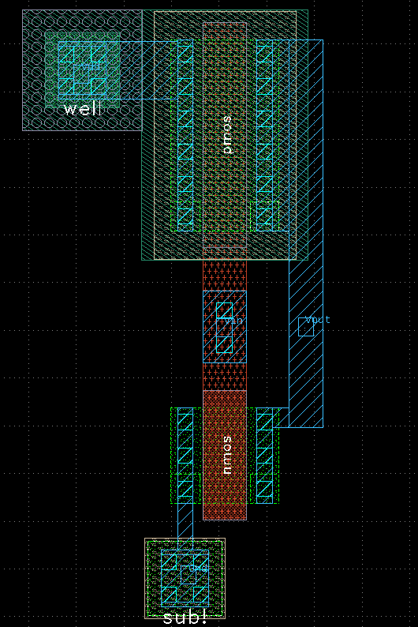

# Parasitic Extraction (PEX)

NOTE: This README refers to the setup in the **comparator** folder, and serves as a base template for how the parasitic extraction was done for the other devices. 

Parasitic extraction is an important step in the analog design flow, kind of like EM simulation. After you finish the physical layout, this step analyzes how unintended parasitic resistances and capacitances affect your circuit’s behavior.

For this workflow, we use the kpex tool developed by  [Martin Jan Köhler](https://github.com/martinjankoehler), which is open-source and integrates well with KLayout. You can find it here: [klayout-pex](https://github.com/martinjankoehler/klayout-pex). Big thanks to Martin for sharing this tool!

You can check out installation instructions directly on the repo or the official website:  [official website](https://martinjankoehler.github.io/klayout-pex-website/).

## Basic Commands

Once installed, run:

```bash
kpex --help
```
From this we see that we have lots of infomration we can specify to `kpex`. As it can be seen there is a lot of different configuration options depending on your use case, lets dive into this simple example:

```
kpex \
  --pdk ihp_sg13g2 \
  --gds design.gds \
  --schematic design.spice \
  --cell top \
  --magic \
  --magic_mode RC \
  --out_dir output/
```
🔧 Explanation of each option:
--pdk ihp_sg13g2  
Specifies the process design kit to use. In this case, the IHP SG13G2 PDK.

--gds design.gds  
Path to the GDS layout file for the design.

--schematic design.spice  
Path to the SPICE netlist of the schematic used for LVS comparison.

--cell top  
Specifies the top-level cell name in the GDS file to extract parasitics from.

--magic  
Tells kpex to use Magic’s parasitic extraction engine (alternatives: `--fastercap`, `--2.5D`, `--fastcap`).

--magic_mode RC  
Specifies the extraction mode used by Magic. Can be:
- `CC` – extract only capacitances
- `RC` – extract resistances and capacitances (default)
- `R` – extract only resistances

--mode RC  
If using `--2.5D` instead of `--magic`, use `--mode` to specify the extraction mode. Same options apply: `CC`, `RC`, or `R`.

--out_dir output/  
Output directory where results (LVS database, parasitic netlist, logs) will be saved.


This can simply be tried out with a gds file to confirm everthing is working

## What will it create?
Taking a very basic inverter example we will start by viewing the netlist from xschem seen here

```
.SUBCKT inverter Vdd Vin Vout Gnd
*.PININFO Vout:B Vdd:B Vin:B Gnd:B
M1 Gnd Vin Vout net2 sg13_lv_nmos w=1.0u l=0.45u ng=1 m=1
M2 Vout Vin Vdd net1 sg13_lv_pmos w=2.0u l=0.45u ng=1 m=1
R1 Vdd net1 ntap1 A=6.084e-13 P=3.12e-06
R2 Gnd net2 ptap1 A=6.084e-13 P=3.12e-06
.ENDS

```

as it can be seen its a very simple netlist with two transistors and tap devices. We have the parameters describing the instace parameters and thats it. Using the flow explained above a simple GDS layout has been made and can be seen below:

<p align="center"> 
   
</p>


for this layout a simple shell script has been made in order to execute the kpex. This i seen below

```
#!/bin/bash
set -e

# Hardcoded paths (except PDK stuff)
PYTHON_ENV="/home/pedersen/misc/klayout_pex/bin/activate"
KPEX_MAGIC_EXE="/home/pedersen/.local/bin/magic"
LAYOUT_PATH="../layout/inverter.gds"
SCHEMATIC="../simulations/inverter.spice"


PDK_NAME="ihp_sg13g2"
MAGICRC="$PDK_ROOT/$PDK_NAME/libs.tech/magic/ihp-sg13g2.magicrc"

# Activate Python environment
source "$PYTHON_ENV"

# Run parasitic extraction with kpex
kpex \
  --pdk "$PDK_NAME" \
  --magic \
  --schematic "$SCHEMATIC" \
  --gds "$LAYOUT_PATH" \
  --magicrc "$MAGICRC" \
  --magic_mode RC \
  --magic_cthresh 0.02 \
  --magic_rthresh 50 \
  --magic_short resistor \
  --magic_merge conservative \
  --out_dir /.pex_output
```

### Script Explanation

This bash script automates parasitic extraction using **kpex** with the IHP SG13G2 PDK. Here's what each part does:

- `set -e`  
  Ensures the script exits immediately if any command fails, preventing cascading errors.

- **paths:**  
  - `PYTHON_ENV`: Path to the Python virtual environment of klayout-pex (optional depending on your setup).  
  - `KPEX_MAGIC_EXE`: Path to the Magic engine executable.  
  - `LAYOUT_PATH`: Relative path to the layout GDS file to extract parasitics from.  
  - `SCHEMATIC`: Relative path to the SPICE netlist schematic used for LVS and parasitic extraction (Top level must be a subcircuit! to be compatible with costum python script later! Refer to LVS guide in klayout)

- `PDK_NAME` and `MAGICRC`:  
  - `PDK_NAME` specifies the Process Design Kit to use (`ihp_sg13g2`).  
  - `MAGICRC` points to the Magic configuration file for the PDK
    (this should be already setup if you followed installation of the IHP open PDK)

- `source "$PYTHON_ENV"`:  
  Activates the Python environment so the `kpex` command and dependencies run properly.

- The `kpex` command runs parasitic extraction with these options:  
  - `--pdk`: Selects the PDK.  
  - `--magic`: Uses Magic’s extraction engine.  
  - `--schematic`: Specifies the schematic netlist for LVS comparison and annotation.  
  - `--gds`: Layout file to extract from.  
  - `--magicrc`: PDK-specific Magic configuration file.  
  - `--magic_mode RC`: Extraction mode producing both resistive and capacitive parasitics.  
  - `--magic_cthresh 0.02`: Capacitance extraction threshold (farads).  
  - `--magic_rthresh 50`: Resistance extraction threshold (ohms).  
  - `--magic_short resistor`: Method to handle shorts using resistors.  
  - `--magic_merge conservative`: Merging style to combine parasitics cautiously.  
  - `--out_dir ./pex_output`: Directory where extraction results (parasitic netlists, logs) are saved.

---

Once the script has been run, a log is printed and a folder is generated containing the results:

```
.
└── inverter__inverter
    ├── inverter_dummy_schematic.spice
    ├── kpex.log
    ├── kpex_plain.log
    └── magic_RC
        ├── inverter.ext
        ├── inverter_MAGIC_RC_Output.txt
        ├── inverter_MAGIC_RC_Script.tcl
        ├── inverter_MAGIC_report.rdb.gz
        ├── inverter.pex.spice
        └── inverter.res.ext
```

Among the outputs, the important file is `inverter.pex.spice`, shown below:

```
* NGSPICE file created from inverter.ext - technology: ihp-sg13g2

.subckt inverter_pex Vdd Vin Vout Gnd
X0 Vout Vin Vdd Vdd sg13_lv_pmos ad=0.68p pd=4.68u as=0.68p ps=4.68u w=2u l=0.45u
X1 Vout Vin Gnd Gnd sg13_lv_nmos ad=0.34p pd=2.68u as=0.34p ps=2.68u w=1u l=0.45u
C0 Vout Vin 0.10077f
C1 Vin Vdd 0.14482f
C2 Vout Vdd 0.13155f
R0 Vin Vin.n0 7.52248
C3 Vout Gnd 0.39245f
C4 Vin Gnd 0.64666f
C5 Vdd Gnd 0.15308f
.ends
```

As can be seen, it's the same netlist structure as shown earlier but now with parasitics inserted.

- The `X0` and `X1` instances are the original PMOS and NMOS devices with additional layout-calculated source/drain diffusion areas (`ad`, `as`) and perimeters (`pd`, `ps`).
- The `C0–C5` elements are **extracted parasitic capacitances** between the nodes in the layout.
- The `R0` entry is a **resistive parasitic**, representing resistance in the interconnect or diffusion.

These parasitics are important for accurate simulation of timing and analog performance, especially in high-speed or precision circuits.

## Integration in Xschem/Ngspice (post-layout simulation)

To simulate the extracted device, several approaches exist. In this example, we’ll keep the entire flow inside Xschem, using Ngspice as the simulator.

Before continuing, please watch the following video by Stefan Schippers (creator of Xschem):  
https://www.youtube.com/watch?v=zs6JPXk074c&t=495s

### Improved Shell Script

As seen in the video, it’s possible to insert a netlist directly into a schematic using a symbol. Imagine a case where you’ve already generated a symbol for a design to use in a testbench — now, you can use that *same* symbol to simulate the extracted version with parasitics included.

To enable this, a shell script has been created:  
`IHP-AnalogAcademy/modules/module_3_8_bit_SAR_ADC/part_5_layout/comparator/pex/run_kpex.sh`  
Relevant parts of this script are shown below.

**Snippet 1** – User configuration:
```
###############################################################################
#                        ⬇⬇⬇ USER CONFIGURATION ⬇⬇⬇                         #
###############################################################################

# Activate Python environment (adjust this path to your Python venv activate script) Or if you python version is >3.12 ignore asuming klayout_pex is installed
PYTHON_ENV="$HOME/misc/klayout_pex/bin/activate" 
# Example: /home/username/misc/klayout_pex/bin/activate

# Path to Magic executable used by kpex (adjust if installed elsewhere)
KPEX_MAGIC_EXE="$HOME/.local/bin/magic" 
# Example: /usr/local/bin/magic or ~/.local/bin/magic

#Path to symbol
SYM_DIR="../xschem_pre_layout/schematic/DIFF_COMPARATOR.sym"       # Asuming you have a symbol for the DUT

LAYOUT_DIR="../layout/DIFF_COMPARATOR.gds"        # Path to the GDS file

# Important: Path to your PDK root directory must be set externally in env variable PDK_ROOT, otherwise give absolute path
PDK_NAME="ihp_sg13g2"         # Your PDK name (must match PDK_ROOT contents)
MAGICRC="$PDK_ROOT/$PDK/libs.tech/magic/ihp-sg13g2.magicrc" # The magicrc file for your PDK, used during extraction

SCHEMATIC="../layout/lvs_netlist/DIFF_COMPARATOR.spice" # Spicefile of the comparator from Schematic or LVS (Used for pex to perform LVS and script to organize IO)
```


As seen above, a new variable has been added for the symbol. In this case, it points to the symbol used earlier for the comparator (from part_1) now copied to this directory. After that, the script runs `kpex`, just like we did for the inverter.

The new logic comes in the next step.

**Snippet 2** – Matching pin order and generating the new symbol:

```
# Find the generated spice file (assuming only one)
spice_location=$(find ./pex_output -type f -name "*.spice" ! -name "*_dummy_schematic.spice" | head -n 1)


if [[ -z "$spice_location" ]]; then
  echo "[ERROR] No .spice file found in pex_output directory"
  exit 1
fi

echo "[INFO] Found extracted spice file: $spice_location"

# Run Python script to fix port ordering in the extracted netlist
echo "[INFO] Reordering subcircuit pins to match original schematic..."
echo "$spice_location"
echo "$SCHEMATIC"

python3 python/match_subckt_order.py "$spice_location" "$SCHEMATIC"


echo "[INFO] Creating DUT symbol with pex netlist"
python3 python/insert_netlist_to_sym.py "$spice_location" "$SYM_DIR" xschem_pex_symbol
```
After running `kpex`, the script looks for the generated PEX netlist and stores the path in the variable `spice_location`. It then calls a Python script `match_subckt_order.py` to fix the pin ordering.

This step is important: the `.subckt` line in the netlist determines the pin order used for simulation, and when its generated in xschem the pin order will be the same for the symbol (which we will use for simulation). If the pin order of the PEX netlist doesn’t match the original netlist from xschem (also used for the symbol), simulation will give false results!

Let’s look at an example:

Original schematic netlist (used in LVS):

for the inverter netlist, this is what it looks like when extracted (Top level is a subcircuit i.e LVS netlist in xschem)
```
.SUBCKT inverter Vdd Vin Vout Gnd
*.PININFO Vout:B Vdd:B Vin:B Gnd:B
M1 Gnd Vin Vout net2 sg13_lv_nmos w=1.0u l=0.45u ng=1 m=1
M2 Vout Vin Vdd net1 sg13_lv_pmos w=2.0u l=0.45u ng=1 m=1
R1 Vdd net1 ntap1 A=6.084e-13 P=3.12e-06
R2 Gnd net2 ptap1 A=6.084e-13 P=3.12e-06
.ENDS

```
the direct output from PEX will give:

```
* NGSPICE file created from inverter.ext - technology: ihp-sg13g2

.subckt inverter Vout Vin Gnd Vdd
X0 Vout Vin Vdd Vdd sg13_lv_pmos ad=0.68p pd=4.68u as=0.68p ps=4.68u w=2u l=0.45u
X1 Vout Vin Gnd Gnd sg13_lv_nmos ad=0.34p pd=2.68u as=0.34p ps=2.68u w=1u l=0.45u
C0 Vout Vdd 0.13155f
C1 Vout Vin 0.10077f
C2 Vin Vdd 0.14482f
R0 Vin Vin.n0 7.52248
C3 Vout Gnd 0.39245f
C4 Vin Gnd 0.64666f
C5 Vdd Gnd 0.15308f
.ends
```
Notice the difference in the `.subckt` pin order? That’s why we use the matching script.

The script is located at:  
`IHP-AnalogAcademy/modules/module_3_8_bit_SAR_ADC/part_5_layout/comparator/pex/python/match_subckt_order.py`

Finally, a second script is called to generate a new symbol containing the reordered PEX netlist:  
`IHP-AnalogAcademy/modules/module_3_8_bit_SAR_ADC/part_5_layout/comparator/pex/python/insert_netlist_to_sym.py`

This creates a symbol placed in:  
`xschem_pex_symbol/`  
You can now use this symbol directly in your testbench to simulate the impact of parasitics.


## Usage in Part_5

In part_5, you’ll find a folder called `comparator`. Key folders inside are:

- `layout/`: contains the comparator layout
- `pex/`: contains the `run_pex.sh` script, Python helpers, and extraction output
- `pex_output/`: holds the PEX netlist after extraction
- `xschem_pex_symbol/`: contains the generated symbol with the PEX netlist
- `xschem_post_layout/`: a copy of the part_1 testbenches, but updated to use the PEX symbol

## Youtube Video

To see this flow in action, please refer to the accompanying video:
[PEX - Example](https://youtu.be/f42GODoe568)


